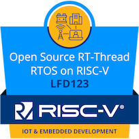
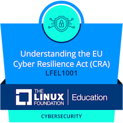
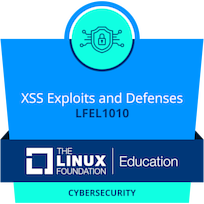
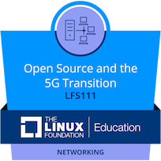
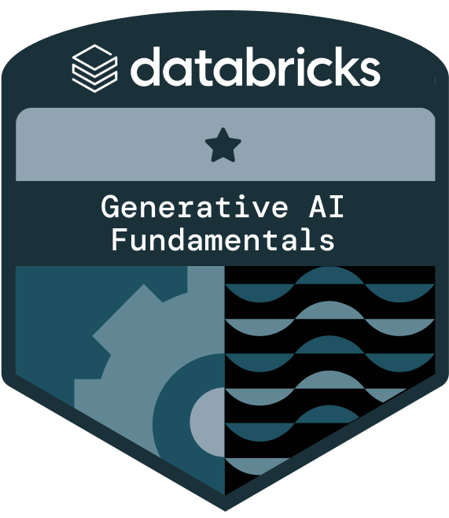
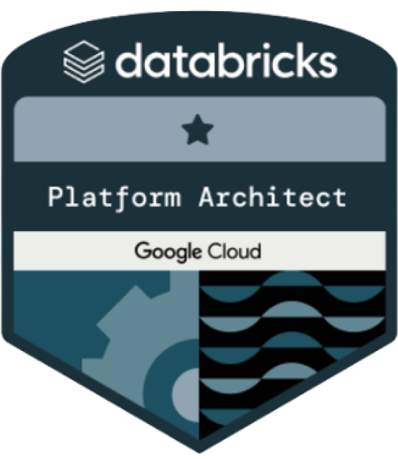
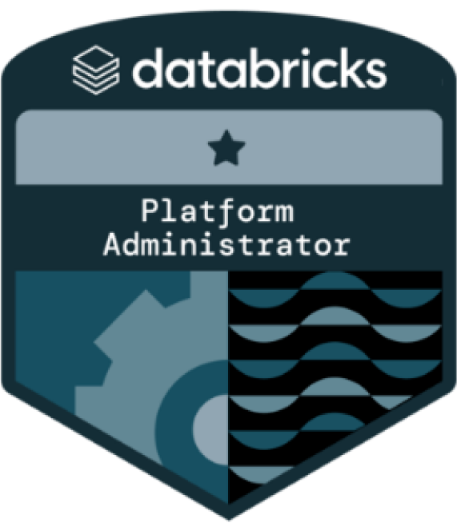
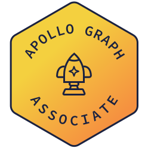
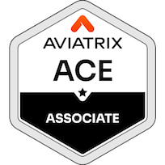

<picture>
  <source media="(prefers-color-scheme: dark)" srcset="./assets/ascii-dark.svg">
  <source media="(prefers-color-scheme: light)" srcset="./assets/ascii.svg">
  
</picture>

 

  
  
  
  
  
  
  
  
  
  
  
  
  

 

  
  
  
  
  
  
  
  
  
  
  
  
  
  
  
  
  
  
  
  
  
  
  
  
  
  
  
  

